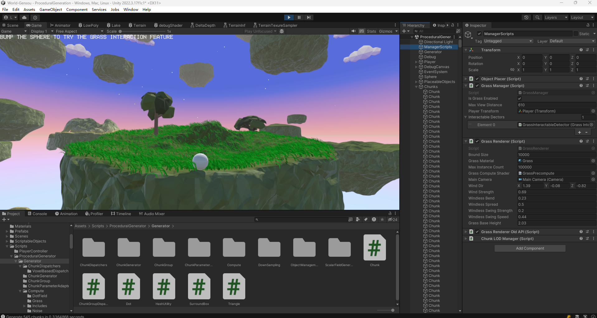
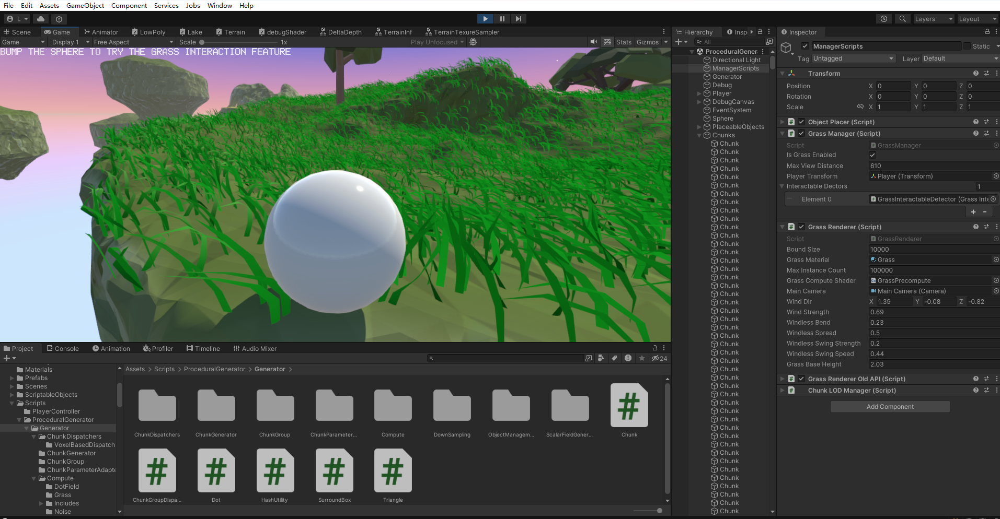
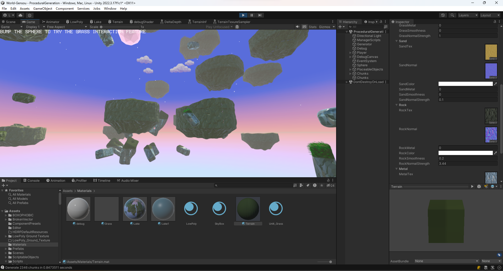
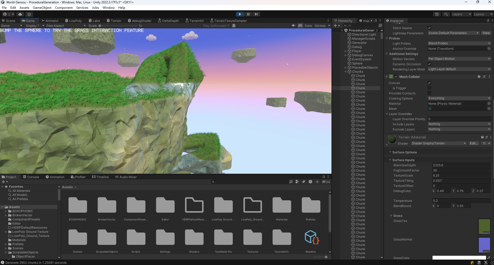
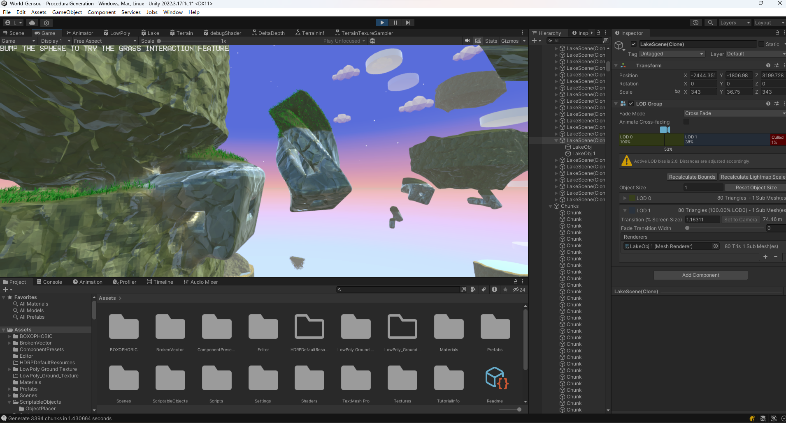
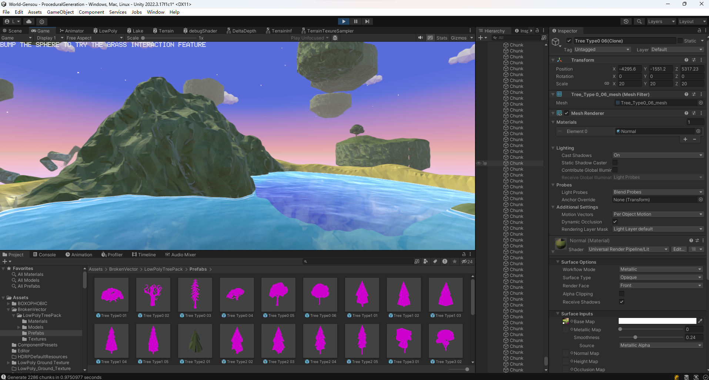
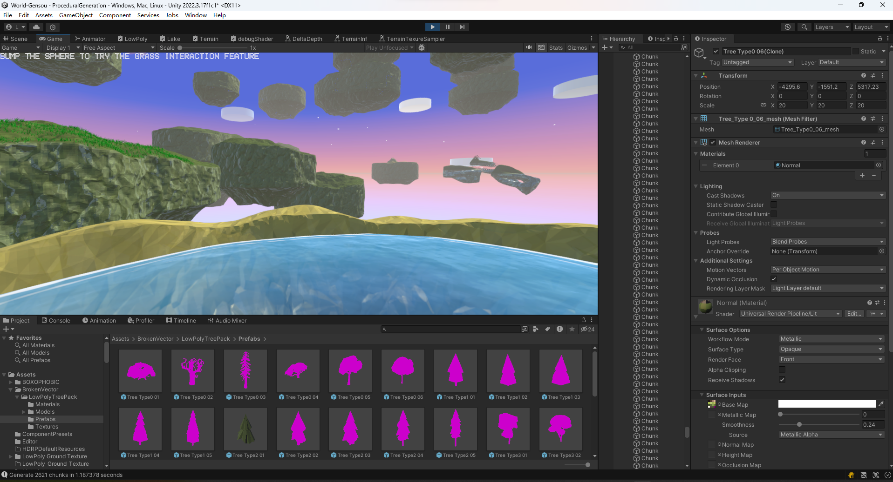
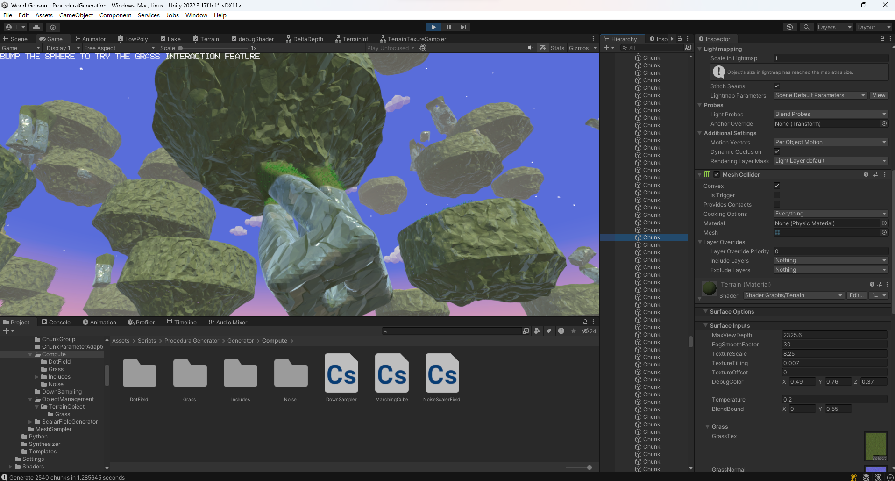
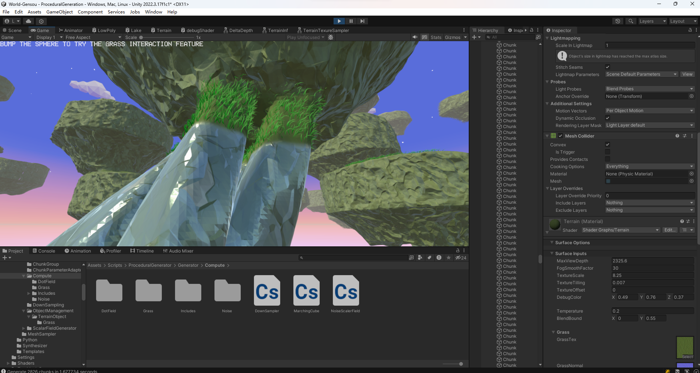

# 程序化生成Demo

## 功能介绍

该项目是一个基于SDF场的PCG无限开放世界生成框架。通过程序化生成方式生成风格化空岛的无限开放世界。世界可以完全哈希化，不需要存储空间便可生成地形。同时提供地形操纵工具，实现实时地形填充或挖掘玩法。
为了实现平滑的地形过渡和玩家对地形的操纵，通过三维SDF形状函数、SDF变换、分形噪声变换，叠加玩家操作对应的SDF，利用Compute Shader计算不同LOD地形区块的隐式几何表示。

当前该项目包含一个空岛示例世界，定义于Assets/Scripts/ProceduralGenerator/Generator/ChunkGroupDispatcher.cs的Initialize()方法中。

+ 为了减轻主线程的阻塞，通过异步Compute Shader和Job System来生成区块Mesh并进行点采样以进一步生成地形上场景物体（草，树等）。
+ 利用Marching Cubes算法将SDF隐式表示三角形化，之后利用Job System来并行加速Mesh生成算法。通过泊松分布和重心坐标系采样来在该job里顺带计算地形上场景物体的位置。
+ 项目分为SDF生成模块，Chunk工厂、Chunk调度模块、Chunk组调度模块、场景物体管理模块等。均利用策略模式实现依赖倒置，最大化减少不必要的依赖，可以随时进行算法扩展。
+ 编写了风格化水的shader，实现了水体颜色渐变、水下物体折射、菲涅尔效应、岸边浪花等基础效果。编写地形shader，通过计算sdf模块生成的顶点色四维向量与地形基底向量的关联权重来判别地形类别，实现不同类别地形材质的插值。利用抖动实现远处渐隐效果。
+ 为了实现大量草的高效渲染和可交互特性，通过Compute Shader根据风向和可交互物体位置计算风吹草动效果与草与物体碰撞的倒伏效果。利用GPU Instancing来实现草渲染的合批。

## 效果展示

